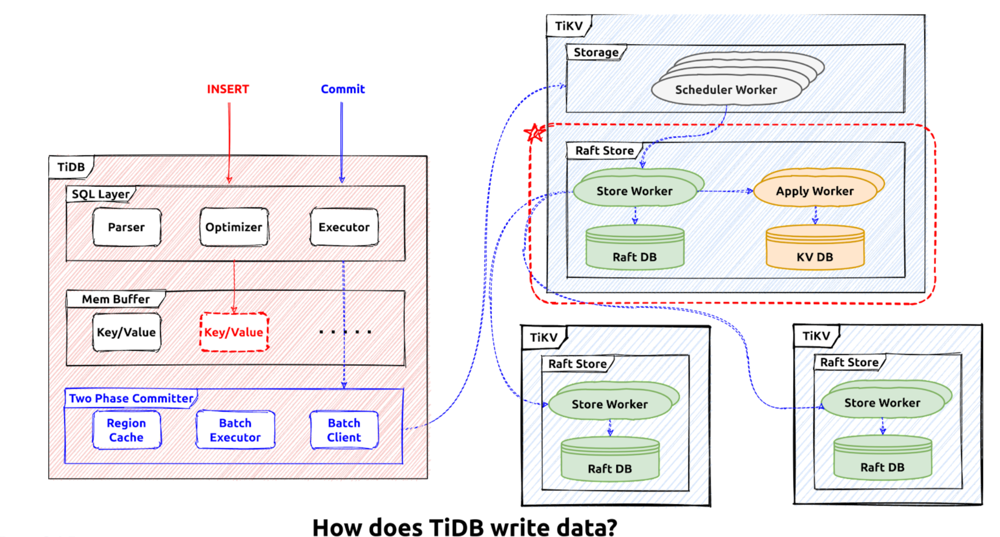
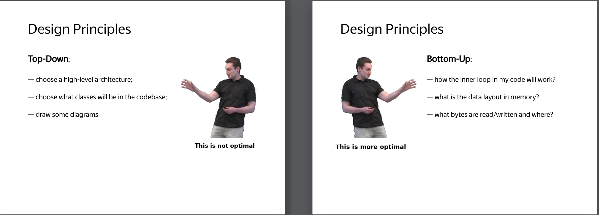
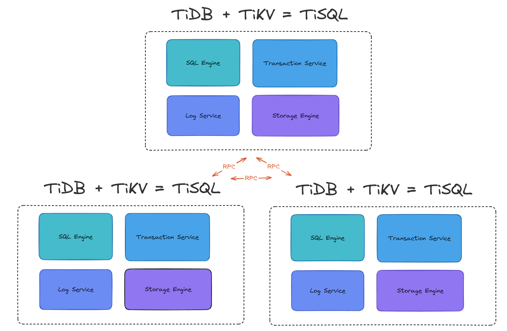
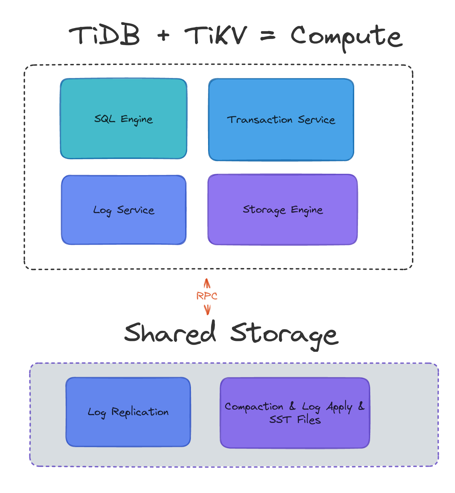
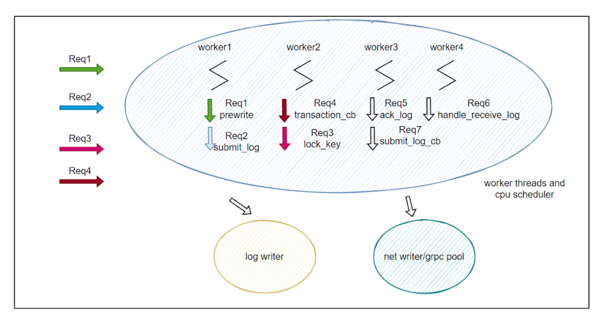
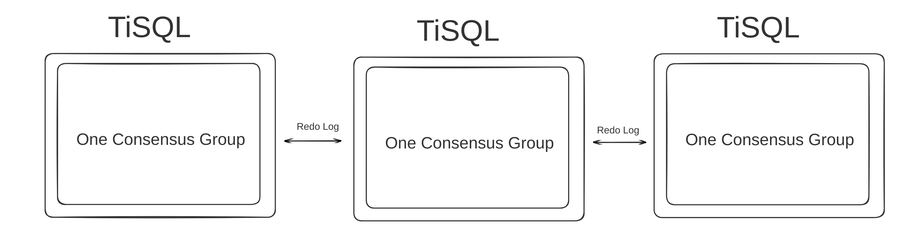

# Motivation

The current TiDB architechture is

There are several drawbacks of this design and implementation.

## RPC & gRPC

The starting price per operation in TiDB requires at leaset one RPC call. The [gRPC](https://grpc.io/) lib is a generic implementation and
it could not help us to achieve the extreme OLTP performance. Together with golang runtime, we've seen much latency jitter in the production
environments. A high performance TiDB specific RPC implementation is needed for better performance.

## The Loosely Coupled design

In TiDB different modules are isolated and they are loosely coupled, the benefit of this is it makes the desgin simpler and easier to implemente.
However, it's difficult to achieve the extreme performance and low cost. For example in TiDB:
- The SQL optimizer is completely isolated from the storage engine, and it's not aware of the engine details like the impact of the LSM storage or
the MVCC overhead, theoratically it's difficult to build an accurate cost model just in the tidb-server side.
- [RocksDB](https://github.com/facebook/rocksdb) is used as a black box for the KV database, and the result is that KV database is not desgined together
with the transction and log engine and serveral implementations in `RocksDB` are not needed by TiDB. **We believe that the design should consider 
the overall gains and losses from the top down, and the implementation should make each module fine enough from the bottom up**. 

- The `raftstore` which is the redo-log engine in tikv is not desgined together with the whole transction model, serveral basic optimizations are not
implemented such as each consensuse group requires the continuous keyspace implicitly, the `log-apply` could not be executed [parallely](https://github.com/FWH-TiKV/RFC)
and the tikv-server could not fully use the machine resources.

## Different Technique Stacks

In TiDB the tidb-server is implemented with `golang`, the tikv-server is implemented with `rust` and `Rocksdb` is implemented with `c/c++`, it's quite
difficult for the developers to re-design and refactor the code as too many tech stacks are invovled. Escpecially `golang` is the biggest problem 
with extreme performance requirement, it's impossible to control and predict the query latency in the tidb-server side.

# Proposal & One Node Fits All

Try to re-design the TiDB architecture, merge the existing service into one node, re-union the technique stacks, make the resources management granular 
enough, follow the `top-down desgin` and `bottom-up implementation` rule.

References:
- OceanBase v4.0 [link](https://mp.weixin.qq.com/s/qYUESs81Fw67WeSlnDvCig) [Video](http://blog.itpub.net/70009762/viewspace-2931176/)

## Merge The Services Into One

Basic idea is described in the following graph.

For the shared-storage architecture.

Merge all the components in TiDB into one, make it possible for furture re-design and code refactor.

## Use Rust

Re-write the SQL engine and transaction service using rust, latter integrate the storage engine using a rust implementation too, combine the 
technique stack into a whole.

## Evolve According To A Bottom-Up Roadmap

### 1. Make It Work

Port the basics of current implementation in tidb-server into the `tisql` project, which is initialy a `tikv` repo. 

The basic server ability:
- A mysql port listner is needed, so are the mysql connection managements.
- The MySQL protocol implementation.
- The SQL parser.
- The SQL session management.
- The SQL planner and executor.
- The SQL transaction service and store abstractio.
- The server worker pool, the user tasks are spwaned to this unified worker pool and handled, the rust asynchronous model would be used.

The first milestone of this is simple queries could be handled properly by the `TiSQL` server.

### 2. Make it Better

Optimize the implementation from bottom-up, make it better for different becnhmarks.

#### CPU Scheduling

#### Transaction & Log Engine

We believe the parallel redo log processing and parallel log apply are better choices for OLTP performance. A single consensus groupd should be 
able to use as much resources as it needs. 

#### Storage Engine

A rust implementation should be introduced. The LSM engine should be desgined carefully to work with the `transaction & log engine` as a whole. This 
is a complex topic, more details would be added later.

