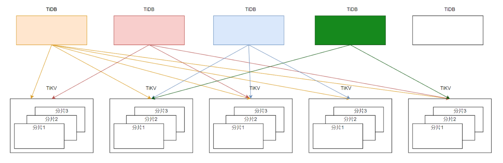
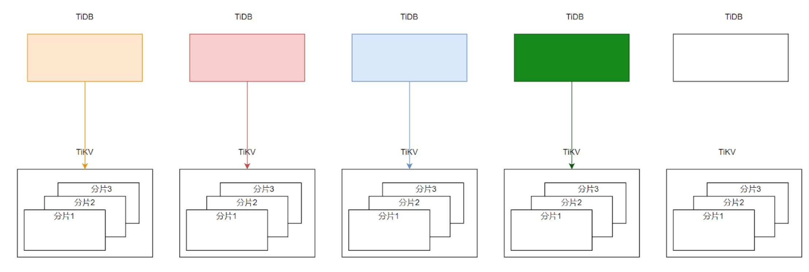
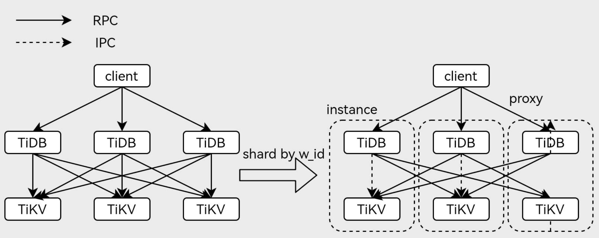
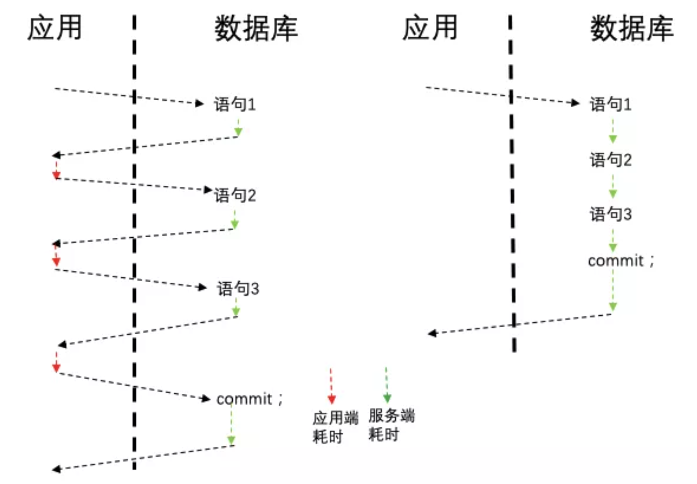

# Why And How Does Round Trip Matters?

## Summary

Find out how the RPC round trips may affect the OLTP performance of TiDB.

## Motivation

In the current architecture and implementation of The TiDB kernel, 
the starting price for all operations is one RPC. Compared with some sharding
system using sharding-middlewares and multiple MySQL instances, TiDB may have a 
performance sometimes for OLTP workloads. So it would be helpful to find out 
**how the RPC round trips affect the OLTP performance** and thus optimizations could 
be done to reduce unnecessary distributed executions to improve the TiDB OLTP performance.

## Background Introduction

In the current design and implementation of TiDB, the request processing is like this:

All the read and write executions are routed to a tidb-server, then different kv-requests are
sent to different tikv-servers which are related to the executions. For example an index lookup
execution, index scan kv-requests are first sent to tikv-servers to fetch row handles then 
table scan kv-requests are sent to tikv-servers again to row data. Besides, if the transaction
commit relates to more than one region 1PC protocol could not be used which means standard 2PC
is still required.

Consider such possibilities:
- The index lookup execution or transaction commit could be finished in just one RPC.
- The RPC latency(from the tidb kv-client to the tikv grpc-server worker pool) could be 
optimized or even avoided.

How does the TiDB may perform for benchmark tests like `TPC-C` or `Sysbench`? Is it necessary
to optimize the RPC libary used in TiDB or is it worthy? Or is it a considerable option to merge
the tidb server code into tikv as `shared-storage` would be introduced in the future as well as
the tidb `session-manager`.

## The Design For Experiments

### Introduce Data Affinity Ability in TiDB

The first thing to make read executions and transaction commit more locally is to make use of
the data affinity from the workload itself. let the "related data" be placed as clustered
as possible. When extreme OLTP performance tuning is considered, it's not just simply let the
pd-server balance the region leaders and region peers according to the total numbers, more steps 
are required:
- Shard the user tables and regions according to the **affinity rule**, using the TiDB sharding
ability or feature. 
- Place the tables and regions with the rules accordingly. This has higher scheduling priority
over other constraints.
- Disable auto split or merge for these table regions or shards, if they're needed then do these
operations with guidance from the user who has the whole picture.
- Do the resource balance as usual.

After this, the request processing is like this:

Theoretically query latency could be reduced, also less resources needs to be used.

### Push Down More executions

As the example shows above, if the index data and row data are placed considering data affinity,
the index lookup execution could be pushed down to the tikv-server and all the work could be 
finished in one RPC, so is the index join execution.

### Use Domain Socket 

It's not practical to merge the tidb code into tikv in a short time, another way to reduce the
RPC latency is to deploy one tidb-server together with one tikv-server together on one physical
machine:

This could save the related work and latency in the link, but it could not save the 
`tidb-batch-client` related processing and serialization/deserialization costs. There are 
already unix-domain support for golang grpc client, so it could be easy to implement in the 
experimental test.

### Implement A TiDB Proxy

A proxy is needed to parse the SQL and calculate the instance target, then route the request
to the target tidb-server. It should be light-weighted and could be deployed together with the
client applications.

The ability of the tidb proxy:
- Connection management. Maintain the client session and server session between client and the TiDB
cluster.
- Simple SQL parser and instance location cache. Parse the SQL statements and then calculate the
target instance together with the instance location information.
- Location cache and refreshing ability. The proxy needs to connect to pd-server to synchronise the
instance information.

### What About Stored Procedure

To extremely reduce the round-trips, an extra option is to support stored-procedure in TiDB, 
thus the whole transaction needs just one round-trip to send request and commit.

## Benchmark Test And Investigation

TODO
